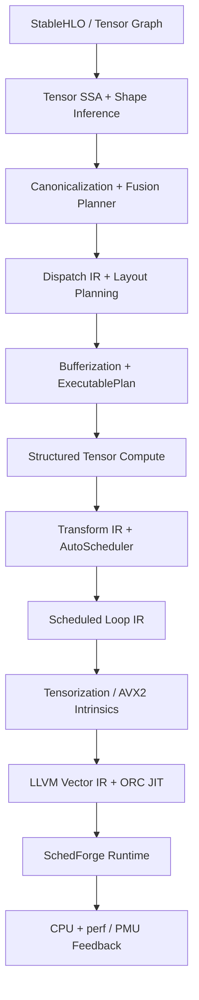

<div align="center">

# SchedForge

**SchedForge — A Model-to-Machine Target-Aware CPU AI Compiler**

**Forge tensor schedules into efficient CPU code.**

[简体中文](README.zh-CN.md) · [Architecture](docs/ARCHITECTURE.md) · [Experiments](results/FINAL_REPORT.md) · [Contributing](CONTRIBUTING.md)

[](https://github.com/BokaiGuo/SchedForge/actions/workflows/ci.yml)
[](https://isocpp.org/)
[](https://llvm.org/)
[](LICENSE)

</div>

SchedForge is a C++20 model-to-machine CPU AI compiler. It imports a practical
StableHLO subset into a multi-operation Tensor SSA graph, performs shape
inference, graph canonicalization, fusion, dispatch formation, layout planning,
bufferization, and workspace reuse, then lowers each dispatch through
Structured Tensor Compute, Transform IR, scheduled Loop IR, tensorization, and
LLVM 18 ORC JIT or native AVX2 execution.

The flagship graph workload is a Transformer MLP block:
`Linear → Bias → GELU → Linear → Bias → Residual`. MatMul remains the kernel
benchmark and hardware auto-tuning laboratory; the MLP is the graph/compiler
benchmark that exercises real use-def chains, fusion boundaries, dynamic shape
guards, temporary tensors, layout propagation, memory lifetime, and dispatch.



## Highlights

- **Compiler infrastructure:** SSA `Type`, `Value`, use-def chains,
  `Operation`, nested `Block`, `Module`, `IRBuilder`, and layered pass managers.
- **Graph compiler:** multi-op Tensor SSA, symbolic/static/dynamic dimensions,
  shape constraints, StableHLO subset import, canonicalization, fusion legality
  and profitability, Dispatch IR, and Transformer MLP compilation.
- **Memory and layout compiler:** layout is part of tensor type; graph layout
  propagation, dispatch-boundary materialization, bufferization, lifetime
  analysis, aligned workspace reuse, and guarded shape specialization.
- **Structured kernel compiler:** iteration domains, parallel/reduction
  iterators, indexing maps, Transform IR serialization/replay, and schedule
  programs generated from measured winners.
- **Explicit executable LoopIR:** Schedule programs rewrite concrete
  `scf.for`, `scf.parallel`, pack, prefetch, load, accumulator, vector FMA,
  epilogue, and store operations. Native execution, simulation, and LLVM
  consume LoopIR rather than reading Schedule fields.
- **CPU scheduling:** multi-level tiling, MR/NR register blocks, K unrolling,
  PackA/PackB, prefetching, vectorization, fusion, affinity, and threading.
- **Generated micro-kernels:** native AVX2/FMA and LLVM 18 ORC paths both support
  register-resident MR×NR kernels; LLVM emits vector FMA code and is checked for
  correctness and vector spill patterns.
- **Hardware-aware modeling:** set-associative L1/L2/L3 caches, DTLB,
  prefetch usefulness, register pressure, spill penalties, packing traffic,
  bandwidth calibration, and target-aware cost estimation.
- **Measurement-first auto-tuning:** every deduplicated legal candidate is run
  on real hardware before randomized finalist remeasurement; analytical and
  learned cost-model APIs consume the resulting measurement database.
- **AI runtime:** serializable `.sfe` ExecutablePlan with constants, buffers,
  dispatches, shape guards, Transform IR, LLVM kernel artifacts, and workspace.
- **Transformer and inference abstractions:** executable MLP, mini-attention
  graph construction, quantized tensor metadata, per-axis quantization
  propagation, BF16/INT8 reference paths, and adaptive specialization guards.

## Quick Start

### 1. Install dependencies

Ubuntu 24.04:

```bash
sudo apt-get update
sudo apt-get install -y \
  build-essential cmake ninja-build \
  llvm-18-dev llvm-18-runtime llvm-18-tools clang-18
```

Optional hardware counters:

```bash
sudo apt-get install -y linux-tools-common linux-tools-generic
```

### 2. Build and test

```bash
git clone https://github.com/BokaiGuo/SchedForge.git
cd SchedForge

cmake -S . -B build -G Ninja -DCMAKE_BUILD_TYPE=Release
cmake --build build --parallel
ctest --test-dir build --output-on-failure
```

If CMake cannot locate LLVM, provide its config directory explicitly:

```bash
cmake -S . -B build -G Ninja \
  -DCMAKE_BUILD_TYPE=Release \
  -DLLVM_DIR=/usr/lib/llvm-18/lib/cmake/llvm
```

### 3. Run the compiler toolchain

```bash
# Dump Tensor IR, scheduled Loop IR, and LLVM IR
./build/schedforge-opt --M=129 --N=131 --K=127

# Inspect cache/TLB/register/prefetch predictions
./build/schedforge-sim --M=256 --N=256 --K=256

# Execute the native AVX2 backend
./build/schedforge-run --backend=native --M=256 --N=256 --K=256

# Execute through LLVM ORC JIT
./build/schedforge-run --backend=llvm --M=256 --N=256 --K=256

# Run calibrated auto-scheduling
./build/schedforge-bench --M=192 --N=192 --K=192 \
  --threads=8 --autoschedule --top-k=12 --calibrate

# Compile a StableHLO Transformer MLP into an executable plan
./build/schedforge-compile examples/transformer_mlp.mlir \
  --target=native-cpu --batch=1 --sequence=16 \
  --hidden=64 --intermediate=128 --threads=4 \
  -o results/transformer_mlp.sfe
```

The model compiler reports imported operations, inferred shapes, fused dispatch
boundaries, layout decisions, naive versus planned temporary memory, selected
kernel schedules, generated LLVM kernels, runtime latency, and validation error.

## Schedule DSL

Schedules are reusable transformation programs, not executable backend
configuration. Applying one produces explicit Scheduled LoopIR; execution
backends do not accept Schedule:

```text
order=ikj;outer=64,128,64;tile=32,64,32;micro=4,8;
vector=8;unroll=4;threads=8;pack=ab;prefetch=4;fuse=true;pin=true
```

The rewritten IR makes loop nesting, parallelism, packing, prefetching,
register-resident reduction, vector width, epilogue placement, and stores
inspectable and verifiable before target lowering.

| Field | Meaning |
|---|---|
| `order` | Loop permutation (`ijk` or `ikj`) |
| `outer` | `MC,NC,KC` outer/cache tiles |
| `tile` | `BM,BN,BK` inner tiles |
| `micro` | `MR,NR` register block |
| `vector` | SIMD width in FP32 lanes |
| `unroll` | K-loop unroll factor |
| `pack` | Pack A, B, both, or neither |
| `prefetch` | Software prefetch distance |
| `threads` | Runtime worker count |
| `fuse` | Fuse Bias/ReLU epilogue |
| `pin` | Pin worker threads to CPUs |

## Tools

| Tool | Purpose |
|---|---|
| `schedforge-opt` | Print Tensor IR, Loop IR, and LLVM IR |
| `schedforge-sim` | Run the hardware-aware simulator and cost model |
| `schedforge-run` | Execute native, LLVM, BF16, or INT8 backends |
| `schedforge-bench` | Auto-schedule and benchmark candidates |
| `schedforge-calibrate` | Calibrate memory bandwidth and model scale |
| `schedforge-search` | Compare schedule-search strategies |
| `schedforge-study` | Run packing crossover and prediction studies |
| `schedforge-resolution` | Measure tuning noise and candidate-resolution limits |
| `schedforge-compile` | Compile StableHLO graphs into `.sfe` ExecutablePlans |

## Graph Compiler Demo

The checked-in `examples/transformer_mlp.mlir` currently produces:

- 12 canonical Tensor SSA operations
- 2 fused dispatches: `MatMul + Bias + GELU` and `MatMul + Bias + Residual`
- blocked `6×16` layout propagation across the dispatch boundary
- naive intermediate tensors: 32,768 bytes
- planned workspace: 8,192 bytes
- 2 LLVM kernel artifacts with Transform IR and AVX2 tensor intrinsics
- 3,825 hardware measurements per dispatch from 16,200 generated candidates
- native scheduled-loop runtime: 0.021 ms on the recorded host
- validated end-to-end MLP execution with maximum error below `1e-3`

See `results/transformer_mlp_compile.txt` and
`results/transformer_mlp.sfe` for the reproducible output.

## Recorded Results

The checked-in results are a snapshot from an Intel Core i5-14600K and are not
universal performance claims.

| Experiment | Recorded result |
|---|---:|
| Native hardware auto-tuning, fused 192³ | **374.402 GFLOPS** |
| Explicit LoopIR fresh validation, fused 192³ | **369.728 GFLOPS** |
| Native hardware auto-tuning, fused 256³ | **390.772 GFLOPS** |
| Native hardware auto-tuning, fused 512³ | **434.863 GFLOPS** |
| LLVM ORC JIT, fused 192³ | **31.216 GFLOPS** |
| BF16 max error vs. FP32, 128³ | **0.0303** |
| INT8 max error vs. FP32, 128³ | **0.0805** |

Fresh auto-tuning statically rejects invalid schedules, deduplicates schedules
that execute identically in the current runtime, runs every remaining candidate
on the host CPU once, and then repeatedly benchmarks the measured finalists in
randomized order. Simulator metrics are reported for diagnosis only; they do
not select the winning schedule.

See [the final experiment report](results/FINAL_REPORT.md) for methodology,
negative results, raw artifact pointers, and claim boundaries.

## Project Layout

```text
include/schedforge/   Public graph, kernel, target, runtime, and simulator APIs
src/                   Graph passes, IR, lowering, LLVM, runtime, and scheduling
tools/                 Compiler command-line tools
examples/              StableHLO model examples
tests/                 Unit and end-to-end validation
docs/                  Architecture and design decisions
results/               Reproducible experiment snapshots and reports
scripts/               Hardware-counter helpers
```

## Scope and Limitations

- SchedForge is a research compiler prototype, not a replacement for oneDNN,
  XLA, IREE, TVM, or production inference runtimes.
- The Transformer MLP path is executable end to end. The mini-attention path,
  quantization propagation, and learned model are implemented compiler
  abstractions but are not yet production-optimized attention/INT8 backends.
- AVX2 is the physically validated SIMD backend. AVX-512 and NEON are target
  abstractions but are not validated code-generation backends in this release.
- NUMA-aware partitioning is implemented, but experiments were run on one NUMA
  node; cross-socket claims are intentionally excluded.
- The simulator is a diagnostic model, not a performance-selection oracle or a
  cycle-accurate Intel out-of-order simulator.
- Performance numbers depend on CPU, frequency policy, compiler, workload, and
  background activity. Re-run the experiments on your own host.

## Documentation

- [Architecture](docs/ARCHITECTURE.md)
- [Graph compiler and `.sfe` format](docs/GRAPH_COMPILER.md)
- [Explicit Scheduled LoopIR](docs/LOOP_IR.md)
- [Experiment design](docs/EXPERIMENT.md)
- [Final experiment report](results/FINAL_REPORT.md)
- [Architecture decisions](docs/decisions/)
- [Contributing](CONTRIBUTING.md)
- [Security policy](SECURITY.md)

## Contributing

Issues and pull requests are welcome. Please read [CONTRIBUTING.md](CONTRIBUTING.md)
and run the full test suite before submitting changes.

## Citation

If SchedForge supports your coursework, research, or engineering experiments,
please cite the repository using [CITATION.cff](CITATION.cff).

## License

SchedForge is released under the [MIT License](LICENSE).
