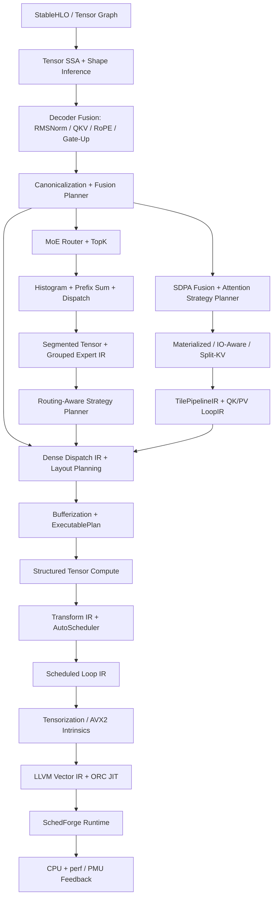

<div align="center">

# SchedForge

**SchedForge — A Model-to-Machine Target-Aware CPU AI Compiler**

**Forge tensor schedules into efficient CPU code.**

[简体中文](README.zh-CN.md) · [Architecture](docs/ARCHITECTURE.md) · [Experiments](results/FINAL_REPORT.md) · [Contributing](CONTRIBUTING.md)

[](https://github.com/BokaiGuo/SchedForge/actions/workflows/ci.yml)
[](https://isocpp.org/)
[](https://llvm.org/)
[](LICENSE)

</div>

SchedForge is a C++20 model-to-machine CPU AI compiler for dense, dynamically
routed sparse, and attention tensor programs. It imports a practical
StableHLO subset into a multi-operation Tensor SSA graph, performs shape
inference, graph canonicalization, fusion, dispatch formation, layout planning,
bufferization, and workspace reuse, then lowers each dispatch through
Structured Tensor Compute, Transform IR, scheduled Loop IR, tensorization, and
LLVM 18 ORC JIT or native AVX2 execution.

The flagship workload is now a complete Llama/Mistral-style Transformer Decoder
Layer. One StableHLO input is imported into one graph, compiled into one
`DecoderExecutablePlan`, and executed by one runtime call across RMSNorm, fused
QKV projection, RoPE, GQA/MQA Flash-style attention, output projection,
residuals, and either Dense SwiGLU or Top-K MoE FFN. MatMul remains the kernel
benchmark and hardware auto-tuning laboratory.

`RMSNorm → Fused QKV → RoPE → GQA/MQA Attention → O Projection → Residual → RMSNorm → Dense SwiGLU / MoE → Residual`.

`Router → Softmax → TopK → Segmented Dispatch → Grouped Expert SwiGLU → Weighted Combine`.

`QKᵀ → Scale → Causal Mask → Online Softmax → PV`, without materializing the
full attention matrix for the IO-aware lowering.



## Highlights

- **Compiler infrastructure:** SSA `Type`, `Value`, use-def chains,
  `Operation`, nested `Block`, `Module`, `IRBuilder`, and layered pass managers.
- **Graph compiler:** multi-op Tensor SSA, symbolic/static/dynamic dimensions,
  shape constraints, StableHLO subset import, canonicalization, fusion legality
  and profitability, Dispatch IR, and Transformer MLP compilation.
- **Decoder Layer compiler:** one StableHLO graph to one executable plan with
  RMSNorm, compile-time packed QKV/Gate-Up weights, RoPE, GQA/MQA attention,
  residuals, Dense SwiGLU, and optional Top-K MoE execution.
- **Realistic Decoder suite:** 24 Tiny/Medium/Large Prefill, Decode, and MoE
  profiles with real-vs-compile-only evidence labels, stage percentages, peak
  workspace, compile/JIT time, and equivalent tokens/s.
- **Whole-graph planner:** `ExecutablePlanOptimizer` jointly chooses Attention
  strategy, layout, materialization, workspace reuse, schedule family, thread
  count, and placement using budgeted end-to-end hardware measurements.
- **MoE compiler:** decomposed Router/TopK/Histogram/Prefix/Dispatch/Combine IR,
  segmented tensors, variable-M grouped expert GEMM, SwiGLU, token buckets,
  routing traces, and load-aware expert task scheduling.
- **Attention compiler:** SDPA graph fusion, MHA/GQA/MQA types, causal tiled
  execution, exact online softmax, TilePipelineIR, materialized and IO-aware
  prefill, growable KV cache, parallel Split-KV decode, and one executable
  fused LLVM online-softmax function.
- **Production LLVM study:** Scheduled LoopIR threads are preserved by ORC
  execution; assembly reports expose instructions, branches, address work,
  stack traffic, and spills, with a reproducible Native-versus-LLVM matrix.
- **Memory and layout compiler:** layout is part of tensor type; graph layout
  propagation, dispatch-boundary materialization, bufferization, lifetime
  analysis, aligned workspace reuse, and guarded shape specialization.
- **Structured kernel compiler:** iteration domains, parallel/reduction
  iterators, indexing maps, Transform IR serialization/replay/direct LoopIR
  application, and schedule programs generated from measured winners.
- **Explicit executable LoopIR:** Schedule programs rewrite concrete
  `scf.for`, `scf.parallel`, pack, prefetch, load, accumulator, vector FMA,
  epilogue, and store operations. Native execution, simulation, and LLVM
  consume LoopIR rather than reading Schedule fields.
- **CPU scheduling:** multi-level tiling, MR/NR register blocks, K unrolling,
  PackA/PackB, prefetching, vectorization, fusion, affinity, and threading.
- **Generated micro-kernels:** native AVX2/FMA and LLVM 18 ORC paths both support
  register-resident MR×NR kernels; LLVM emits vector FMA code and is checked for
  correctness and vector spill patterns.
- **Hardware-aware modeling:** set-associative L1/L2/L3 caches, DTLB,
  prefetch usefulness, register pressure, spill penalties, packing traffic,
  bandwidth calibration, and target-aware cost estimation.
- **Measurement-first auto-tuning:** every deduplicated legal candidate is run
  on real hardware before randomized finalist remeasurement; analytical and
  learned cost-model APIs consume the resulting measurement database, and
  `schedforge-compile --measurement-db=records.csv` reuses measured winners.
- **AI runtime:** serializable `.sfe` ExecutablePlan with constants, buffers,
  dispatches, shape guards, Transform IR, LLVM kernel artifacts, and workspace;
  MLP specialization concretizes dynamic Tensor SSA, buffers, loops, and LLVM.
- **Transformer and inference abstractions:** executable Dense MLP, MoE, prefill
  attention and KV-cache decode; quantized tensor metadata, per-axis quantization
  propagation, BF16/INT8 reference paths, and adaptive specialization guards.
- **Single-source graph epilogues:** native execution and LLVM ORC both consume
  explicit Scheduled LoopIR GELU/residual operations rather than wrapper code.

## Quick Start

### 1. Install dependencies

Ubuntu 24.04:

```bash
sudo apt-get update
sudo apt-get install -y \
  build-essential cmake ninja-build \
  llvm-18-dev llvm-18-runtime llvm-18-tools clang-18
```

Optional hardware counters:

```bash
sudo apt-get install -y linux-tools-common linux-tools-generic
```

### 2. Build and test

```bash
git clone https://github.com/BokaiGuo/SchedForge.git
cd SchedForge

cmake -S . -B build -G Ninja -DCMAKE_BUILD_TYPE=Release
cmake --build build --parallel
ctest --test-dir build --output-on-failure
```

If CMake cannot locate LLVM, provide its config directory explicitly:

```bash
cmake -S . -B build -G Ninja \
  -DCMAKE_BUILD_TYPE=Release \
  -DLLVM_DIR=/usr/lib/llvm-18/lib/cmake/llvm
```

### 3. Run the compiler toolchain

```bash
# Dump Tensor IR, scheduled Loop IR, and LLVM IR
./build/schedforge-opt --M=129 --N=131 --K=127

# Inspect cache/TLB/register/prefetch predictions
./build/schedforge-sim --M=256 --N=256 --K=256

# Execute the native AVX2 backend
./build/schedforge-run --backend=native --M=256 --N=256 --K=256

# Execute through LLVM ORC JIT
./build/schedforge-run --backend=llvm --M=256 --N=256 --K=256

# Run calibrated auto-scheduling
./build/schedforge-bench --M=192 --N=192 --K=192 \
  --threads=8 --autoschedule --top-k=12 --calibrate

# Compile a StableHLO Transformer MLP into an executable plan
./build/schedforge-compile examples/transformer_mlp.mlir \
  --target=native-cpu --batch=1 --sequence=16 \
  --hidden=64 --intermediate=128 --threads=4 \
  -o results/transformer_mlp.sfe

# Compile and execute one complete Dense Transformer Decoder Layer
./build/schedforge-decoder examples/decoder_layer.mlir \
  --batch=1 --sequence=4 --hidden=16 --intermediate=32 \
  --q-heads=4 --kv-heads=2 --head-dim=4 --threads=2 \
  -o results/decoder_dense.sfe

# Execute the Decoder Layer with a Top-2 MoE FFN
./build/schedforge-decoder examples/decoder_layer_moe.mlir --moe \
  --batch=1 --sequence=4 --hidden=16 --intermediate=32 \
  --q-heads=4 --kv-heads=2 --head-dim=4 --experts=4 --top-k=2 \
  --threads=2 -o results/decoder_moe.sfe

# Run the realistic Decoder matrix; expensive rows remain compile-only
./build/schedforge-decoder-bench --suite=realistic --threads=8 \
  --repetitions=5 --max-real-gflop=1.2 --max-weight-mib=256 \
  --output=results/decoder_realistic.csv

# Measure whole-graph plan candidates against the explicit default baseline
./build/schedforge-decoder-bench --suite=optimizer --threads=8 \
  --repetitions=9 --max-real-gflop=1.2 --max-weight-mib=256 \
  --output=results/decoder_plan_optimizer.csv

# Compile and run a dynamically routed Top-2 MoE MLP
./build/schedforge-moe --tokens=128 --hidden=512 --intermediate=2048 \
  --experts=8 --top-k=2 --threads=8 --router-data \
  --strategy=auto -o results/moe_mlp.sfe

# Compile and run exact CPU Flash-style causal prefill attention
./build/schedforge-attention \
  --batch=1 --q-heads=8 --kv-heads=8 --sq=128 --sk=128 \
  --head-dim=64 --value-dim=64 --causal --threads=8 \
  --strategy=auto -o results/attention_prefill.sfe

# Compile and run GQA Split-KV decode against a KV cache
./build/schedforge-attention \
  --batch=1 --q-heads=8 --kv-heads=2 --sq=1 --sk=1024 \
  --head-dim=64 --value-dim=64 --causal --threads=8 \
  --strategy=auto -o results/attention_decode.sfe

# Run routing-skew, grouped-execution, and scheduler experiments
./build/schedforge-moe --tokens=64 --hidden=64 --intermediate=128 \
  --experts=8 --top-k=2 --threads=8 --routing=heavy \
  --experiment-csv=results/moe_strategy_matrix.csv
```

The model compiler reports imported operations, inferred shapes, fused dispatch
boundaries, layout decisions, naive versus planned temporary memory, selected
kernel schedules, generated LLVM kernels, runtime latency, and validation error.

## Schedule DSL

Schedules are reusable transformation programs, not executable backend
configuration. Applying one produces explicit Scheduled LoopIR; execution
backends do not accept Schedule:

```text
order=ikj;outer=64,128,64;tile=32,64,32;micro=4,8;
vector=8;unroll=4;threads=8;pack=ab;prefetch=4;fuse=true;pin=true
```

The rewritten IR makes loop nesting, parallelism, packing, prefetching,
register-resident reduction, vector width, epilogue placement, and stores
inspectable and verifiable before target lowering.

| Field | Meaning |
|---|---|
| `order` | Loop permutation (`ijk` or `ikj`) |
| `outer` | `MC,NC,KC` outer/cache tiles |
| `tile` | `BM,BN,BK` inner tiles |
| `micro` | `MR,NR` register block |
| `vector` | SIMD width in FP32 lanes |
| `unroll` | K-loop unroll factor |
| `pack` | Pack A, B, both, or neither |
| `prefetch` | Software prefetch distance |
| `threads` | Runtime worker count |
| `fuse` | Fuse Bias/ReLU epilogue |
| `pin` | Pin worker threads to CPUs |

## Tools

| Tool | Purpose |
|---|---|
| `schedforge-opt` | Print Tensor IR, Loop IR, and LLVM IR |
| `schedforge-sim` | Run the hardware-aware simulator and cost model |
| `schedforge-run` | Execute native, LLVM, BF16, or INT8 backends |
| `schedforge-bench` | Auto-schedule and benchmark candidates |
| `schedforge-calibrate` | Calibrate memory bandwidth and model scale |
| `schedforge-search` | Compare schedule-search strategies |
| `schedforge-study` | Run packing crossover and prediction studies |
| `schedforge-resolution` | Measure tuning noise and candidate-resolution limits |
| `schedforge-compile` | Compile StableHLO graphs into `.sfe` ExecutablePlans |
| `schedforge-moe` | Compile, simulate, execute, and compare MoE execution plans |
| `schedforge-attention` | Compile, tune, simulate, and execute attention plans |
| `schedforge-decoder` | Compile and execute a complete Dense or MoE Decoder Layer |
| `schedforge-decoder-bench` | Run realistic Decoder and whole-plan studies |
| `schedforge-codegen-study` | Compare Native and LLVM code quality from identical LoopIR |

## Decoder Layer Compiler Demo

SchedForge 0.7 compiles `examples/decoder_layer.mlir` or
`examples/decoder_layer_moe.mlir` as one graph and emits a single `.sfe` plan
containing the imported and canonical Tensor SSA graphs,
fusion decisions, packed constants, memory plan, scheduled QKV/O/Gate-Up/Down
LoopIR, embedded Attention or MoE plans, and LLVM kernel artifacts. Q, K, and V
weights are concatenated once at compile time; Dense Gate and Up weights use the
same specialization path.

The checked-in real CPU smoke uses `B=1, S=4, H=16, I=32, Hq=4, Hkv=2, D=4`.
The Dense path records **0.025 ms** end-to-end and the MoE path **0.099 ms**, both
with **0.000** maximum printed error. These tiny-shape numbers validate one-plan
execution and are not throughput claims. See `results/decoder_dense_run.txt`,
`results/decoder_moe_run.txt`, and [the Decoder compiler design](docs/DECODER_COMPILER.md).

## Realistic Decoder and Whole-Graph Planning

SchedForge 0.8/0.9 adds a 24-profile architecture matrix. On the recorded
Intel Core i5-14600K, **12 profiles executed on real hardware** and **12 were
retained as compile-only feasibility rows** because they exceeded the configured
1.2 GFLOP or 256 MiB weight budget. Compile-only rows contain zero runtime
latency by construction; they are not simulator estimates.

Representative measured results include Tiny Prefill `S=128` at **3.753 ms**
(**34,110 token/s**), Tiny Decode `KV=512` at **1.443 ms**
(**693 token/s**), Medium Decode `KV=4096` at **12.817 ms**
(**78 token/s**), and Tiny 8-expert Top-2 MoE at **8.509 ms** under uniform
routing. All measured rows validate below `1e-3` error.

The whole-graph study evaluates the explicit default plan plus six
analytically prioritized alternatives for Tiny Prefill and Decode. Every
candidate receives equal warmup; an apparent winner is then checked by three
interleaved baseline/winner measurements. Tiny Prefill retained the default
plan (**1.000×**), while Tiny Decode `KV=512` selected a one-thread,
non-materializing Split-KV plan at a confirmed **1.400×** over the default.
See `results/decoder_realistic.csv`,
`results/decoder_plan_optimizer.csv`, and
`results/decoder_plan_optimizer_candidates.csv`.

## Production LLVM and Fused Attention CodeGen

SchedForge 0.10 carries the `threads` decision from the same Scheduled LoopIR
into LLVM ORC execution with MR-aligned row partitions. The checked-in
`192/256/512³` study records LLVM at **103-153 GFLOPS** and native at
**238-367 GFLOPS**. This reduces the earlier order-of-magnitude mismatch, but
LLVM remains **1.8-2.5× slower** on these rows; the gap is not claimed closed.

The Attention backend can also emit and execute one LLVM function that performs
QK, exact online max/sum rescaling, PV accumulation, and final normalization
without materializing `Sq×Sk`. At `B=1, Hq=8, D=64`, fused LLVM records
**0.791 ms** for MHA Prefill `S=128`, **0.786 ms** for GQA Prefill `S=128`, and
**0.214 ms** for GQA Decode `Sk=1024`, with maximum error below `5e-8`.
The specialized native paths remain **2.1-3.1× faster**, and the emitted fused
Attention assembly still contains a vector spill pattern. These negative code-
quality results are first-class evidence, not hidden limitations. See
`results/llvm_codegen_study.csv` and `results/fused_attention_llvm.csv`.

## MoE Compiler Demo

SchedForge 0.4 lowers MoE into 18 Tensor SSA operations and an 11-operation
Routing/Expert program. The `.sfe` artifact embeds segmented tensor metadata,
dynamic token guards, execution strategy IR, token-bucketed W1/W3/W2 LoopIR,
and LLVM ORC-compiled kernel artifacts.

The requested full FP32 MVP, `T=128, H=512, I=2048, E=8, TopK=2`, executes on
the recorded Intel Core i5-14600K with **35.843 ms P50** and **37.789 ms P95**
latency with zero observed validation error. The multi-row AVX2 expert
microkernel reuses each loaded expert-weight vector across multiple routed
tokens. This is a correctness-first single-host implementation, not a claim of
production MoE throughput.

For the checked-in full-shape study (`T=128, H=512, I=2048`), heavy routing skew
raises fixed grouped simulated imbalance to 2.0. Load-aware splitting reduces
it to 0 and improves grouped P50 latency from **26.780 ms** to **20.113 ms** on
the recorded run. The complete 27-case matrix is stored in
`results/moe_strategy_matrix.csv`.

## Attention Compiler Demo

SchedForge 0.5 recognizes the semantic SDPA chain, forms `attention.sdpa`, and
selects among materialized, tiled-materialized, IO-aware prefill, and Split-KV
decode algorithms. The IO-aware path uses a fused `BQ×BK` TilePipelineIR with
online row maximum, denominator, rescaling, and output numerator state. It is
exact attention and never allocates the full `Sq×Sk` score/probability matrices.

On the recorded Intel Core i5-14600K, causal MHA prefill
`B=1, H=8, Sq=Sk=128, D=64` runs in **0.262 ms P50** with zero printed error.
GQA decode `Hq=8, Hkv=2, Sq=1, Sk=1024, D=64` selects parallel Split-KV and
runs in **0.112 ms P50** with zero printed error.

At `S=512`, the measured four-strategy study reduces temporary storage from
**16 MiB** for materialized attention to **49 KiB** for auto-scheduled
IO-aware attention, while P50 latency falls from **18.929 ms** to **2.947 ms**.
The 96-case scaling analysis covers heads `8/12`, dimensions `64/128`, and
sequence lengths `128–4096`. A 200-execution Linux PMU run at `S=512` records
P-core IPC **2.561**, L1D miss rate **1.066%**, and cache-reference miss rate
**16.230%**; these process counters include runtime/framework overhead.

## Graph Compiler Demo

The checked-in `examples/transformer_mlp.mlir` currently produces:

- 12 canonical Tensor SSA operations
- 2 fused dispatches: `MatMul + Bias + GELU` and `MatMul + Bias + Residual`
- blocked `6×16` layout propagation across the dispatch boundary
- naive intermediate tensors: 32,768 bytes
- planned workspace: 8,192 bytes
- 2 LLVM kernel artifacts with Transform IR and AVX2 tensor intrinsics
- 3,825 hardware measurements per dispatch from 16,200 generated candidates
- native scheduled-loop runtime: 0.021 ms on the recorded host
- validated end-to-end MLP execution with maximum error below `1e-3`

See `results/transformer_mlp_compile.txt` and
`results/transformer_mlp.sfe` for the reproducible output.

## Recorded Results

The checked-in results are a snapshot from an Intel Core i5-14600K and are not
universal performance claims.

| Experiment | Recorded result |
|---|---:|
| Native hardware auto-tuning, fused 192³ | **374.402 GFLOPS** |
| Explicit LoopIR fresh validation, fused 192³ | **369.728 GFLOPS** |
| Native hardware auto-tuning, fused 256³ | **390.772 GFLOPS** |
| Native hardware auto-tuning, fused 512³ | **434.863 GFLOPS** |
| LLVM ORC JIT, fused 192³ | **31.216 GFLOPS** |
| BF16 max error vs. FP32, 128³ | **0.0303** |
| INT8 max error vs. FP32, 128³ | **0.0805** |

Fresh auto-tuning statically rejects invalid schedules, deduplicates schedules
that execute identically in the current runtime, runs every remaining candidate
on the host CPU once, and then repeatedly benchmarks the measured finalists in
randomized order. Simulator metrics are reported for diagnosis only; they do
not select the winning schedule.

See [the final experiment report](results/FINAL_REPORT.md) for methodology,
negative results, raw artifact pointers, and claim boundaries.

## Project Layout

```text
include/schedforge/   Public graph, kernel, target, runtime, and simulator APIs
src/                   Graph passes, IR, lowering, LLVM, runtime, and scheduling
tools/                 Compiler command-line tools
examples/              StableHLO model examples
tests/                 Unit and end-to-end validation
docs/                  Architecture and design decisions
results/               Reproducible experiment snapshots and reports
scripts/               Hardware-counter helpers
```

## Scope and Limitations

- SchedForge is a research compiler prototype, not a replacement for oneDNN,
  XLA, IREE, TVM, or production inference runtimes.
- The complete Dense/MoE Decoder Layer, Transformer MLP, FP32 Top-2 MoE, exact
  IO-aware prefill attention, and contiguous-KV Split-KV decode paths execute
  and validate end to end.
- Realistic Large rows are compile-feasibility evidence on this host; no Large
  runtime latency is claimed when weight or FLOP budgets reject execution.
- AVX2 is the physically validated SIMD backend. AVX-512 and NEON are target
  abstractions but are not validated code-generation backends in this release.
- MoE P-core/E-core placement, NUMA-aware execution, quantized experts,
  block-sparse lowering, and distributed expert parallelism are not implemented.
- Attention is a CPU cache-hierarchy adaptation of Flash-style exact attention,
  not an implementation or performance claim for GPU FlashAttention-2.
- Paged KV allocation, BF16/INT8 attention, dropout/backward, distributed
  attention, and spill-free native-parity fused LLVM code remain future work.
- The simulator is a diagnostic model, not a performance-selection oracle or a
  cycle-accurate Intel out-of-order simulator.
- Performance numbers depend on CPU, frequency policy, compiler, workload, and
  background activity. Re-run the experiments on your own host.

## Documentation

- [Architecture](docs/ARCHITECTURE.md)
- [Graph compiler and `.sfe` format](docs/GRAPH_COMPILER.md)
- [Explicit Scheduled LoopIR](docs/LOOP_IR.md)
- [MoE compiler pipeline](docs/MOE_COMPILER.md)
- [Attention compiler pipeline](docs/ATTENTION_COMPILER.md)
- [Decoder Layer compiler pipeline](docs/DECODER_COMPILER.md)
- [Experiment design](docs/EXPERIMENT.md)
- [Final experiment report](results/FINAL_REPORT.md)
- [Architecture decisions](docs/decisions/)
- [Contributing](CONTRIBUTING.md)
- [Security policy](SECURITY.md)

## Contributing

Issues and pull requests are welcome. Please read [CONTRIBUTING.md](CONTRIBUTING.md)
and run the full test suite before submitting changes.

## Citation

If SchedForge supports your coursework, research, or engineering experiments,
please cite the repository using [CITATION.cff](CITATION.cff).

## License

SchedForge is released under the [MIT License](LICENSE).
