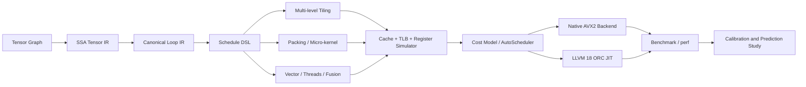

<div align="center">

# SchedForge

**SchedForge — A Target-Aware CPU Tensor Compiler**

**Forge tensor schedules into efficient CPU code.**

[简体中文](README.zh-CN.md) · [Architecture](docs/ARCHITECTURE.md) · [Experiments](results/FINAL_REPORT.md) · [Contributing](CONTRIBUTING.md)

[](https://github.com/BokaiGuo/SchedForge/actions/workflows/ci.yml)
[](https://isocpp.org/)
[](https://llvm.org/)
[](LICENSE)

</div>

SchedForge is an educational and research-oriented CPU tensor compiler written
in C++20. It lowers tensor computation into scheduled loop IR, evaluates
candidate schedules with a cache/TLB/register cost model, and executes the
selected plan through either native AVX2 micro-kernels or LLVM 18 ORC JIT.

The project focuses on one deep path—fused FP32 `MatMul + Bias + ReLU`—instead
of presenting a broad but shallow operator collection. The same schedule object
is consumed by lowering, simulation, native execution, LLVM code generation,
debugging tools, and auto-tuning.



## Highlights

- **Compiler infrastructure:** SSA `Type`, `Value`, use-def chains,
  `Operation`, nested `Block`, `Module`, `IRBuilder`, and layered pass managers.
- **Tensor-to-loop lowering:** separate computation semantics from scheduling;
  both the simulator and code generators consume the same Loop IR.
- **CPU scheduling:** multi-level tiling, MR/NR register blocks, K unrolling,
  PackA/PackB, prefetching, vectorization, fusion, affinity, and threading.
- **Two executable backends:** native AVX2/FMA micro-kernels and real LLVM 18
  `IRBuilder` + O3 + ORC `LLJIT`, including assembly emission and analysis.
- **Hardware-aware modeling:** set-associative L1/L2/L3 caches, DTLB,
  prefetch usefulness, register pressure, spill penalties, packing traffic,
  bandwidth calibration, and target-aware cost estimation.
- **Auto-tuning and research tools:** grid, random, greedy, and evolutionary
  search; simulator-guided top-k hardware measurement; Spearman correlation and
  top-k recall analysis.
- **Runtime features:** dynamic-shape buckets, persistent kernel artifacts,
  layout propagation, lifetime-based memory planning, NUMA topology detection,
  thread affinity, BF16, and INT8 reference paths.

## Quick Start

### 1. Install dependencies

Ubuntu 24.04:

```bash
sudo apt-get update
sudo apt-get install -y \
  build-essential cmake ninja-build \
  llvm-18-dev llvm-18-runtime llvm-18-tools clang-18
```

Optional hardware counters:

```bash
sudo apt-get install -y linux-tools-common linux-tools-generic
```

### 2. Build and test

```bash
git clone https://github.com/BokaiGuo/SchedForge.git
cd SchedForge

cmake -S . -B build -G Ninja -DCMAKE_BUILD_TYPE=Release
cmake --build build --parallel
ctest --test-dir build --output-on-failure
```

If CMake cannot locate LLVM, provide its config directory explicitly:

```bash
cmake -S . -B build -G Ninja \
  -DCMAKE_BUILD_TYPE=Release \
  -DLLVM_DIR=/usr/lib/llvm-18/lib/cmake/llvm
```

### 3. Run the compiler toolchain

```bash
# Dump Tensor IR, scheduled Loop IR, and LLVM IR
./build/schedforge-opt --M=129 --N=131 --K=127

# Inspect cache/TLB/register/prefetch predictions
./build/schedforge-sim --M=256 --N=256 --K=256

# Execute the native AVX2 backend
./build/schedforge-run --backend=native --M=256 --N=256 --K=256

# Execute through LLVM ORC JIT
./build/schedforge-run --backend=llvm --M=256 --N=256 --K=256

# Run calibrated auto-scheduling
./build/schedforge-bench --M=192 --N=192 --K=192 \
  --threads=8 --autoschedule --top-k=12 --calibrate
```

## Schedule DSL

Schedules are reusable compiler objects rather than backend-only flags:

```text
order=ikj;outer=64,128,64;tile=32,64,32;micro=4,8;
vector=8;unroll=4;threads=8;pack=ab;prefetch=4;fuse=true;pin=true
```

| Field | Meaning |
|---|---|
| `order` | Loop permutation (`ijk` or `ikj`) |
| `outer` | `MC,NC,KC` outer/cache tiles |
| `tile` | `BM,BN,BK` inner tiles |
| `micro` | `MR,NR` register block |
| `vector` | SIMD width in FP32 lanes |
| `unroll` | K-loop unroll factor |
| `pack` | Pack A, B, both, or neither |
| `prefetch` | Software prefetch distance |
| `threads` | Runtime worker count |
| `fuse` | Fuse Bias/ReLU epilogue |
| `pin` | Pin worker threads to CPUs |

## Tools

| Tool | Purpose |
|---|---|
| `schedforge-opt` | Print Tensor IR, Loop IR, and LLVM IR |
| `schedforge-sim` | Run the hardware-aware simulator and cost model |
| `schedforge-run` | Execute native, LLVM, BF16, or INT8 backends |
| `schedforge-bench` | Auto-schedule and benchmark candidates |
| `schedforge-calibrate` | Calibrate memory bandwidth and model scale |
| `schedforge-search` | Compare schedule-search strategies |
| `schedforge-study` | Run packing crossover and prediction studies |
| `schedforge-resolution` | Measure tuning noise and candidate-resolution limits |

## Recorded Results

The checked-in results are a snapshot from an Intel Core i5-14600K and are not
universal performance claims.

| Experiment | Recorded result |
|---|---:|
| Native hardware auto-tuning, fused 192³ | **374.402 GFLOPS** |
| Native hardware auto-tuning, fused 256³ | **390.772 GFLOPS** |
| Native hardware auto-tuning, fused 512³ | **434.863 GFLOPS** |
| LLVM ORC JIT, fused 192³ | **31.216 GFLOPS** |
| BF16 max error vs. FP32, 128³ | **0.0303** |
| INT8 max error vs. FP32, 128³ | **0.0805** |

Fresh auto-tuning statically rejects invalid schedules, deduplicates schedules
that execute identically in the current runtime, runs every remaining candidate
on the host CPU once, and then repeatedly benchmarks the measured finalists in
randomized order. Simulator metrics are reported for diagnosis only; they do
not select the winning schedule.

See [the final experiment report](results/FINAL_REPORT.md) for methodology,
negative results, raw artifact pointers, and claim boundaries.

## Project Layout

```text
include/schedforge/   Public compiler, IR, runtime, and simulator APIs
src/                   IR, lowering, LLVM, runtime, simulation, and scheduling
tools/                 Compiler command-line tools
tests/                 Unit and end-to-end validation
docs/                  Architecture and design decisions
results/               Reproducible experiment snapshots and reports
scripts/               Hardware-counter helpers
```

## Scope and Limitations

- SchedForge is a compiler prototype, not a replacement for BLIS, oneDNN, or
  production graph compilers.
- AVX2 is the physically validated SIMD backend. AVX-512 and NEON are target
  abstractions but are not validated code-generation backends in this release.
- NUMA-aware partitioning is implemented, but experiments were run on one NUMA
  node; cross-socket claims are intentionally excluded.
- The simulator is a diagnostic model, not a performance-selection oracle or a
  cycle-accurate Intel out-of-order simulator.
- Performance numbers depend on CPU, frequency policy, compiler, workload, and
  background activity. Re-run the experiments on your own host.

## Documentation

- [Architecture](docs/ARCHITECTURE.md)
- [Experiment design](docs/EXPERIMENT.md)
- [Final experiment report](results/FINAL_REPORT.md)
- [Architecture decisions](docs/decisions/)
- [Contributing](CONTRIBUTING.md)
- [Security policy](SECURITY.md)

## Contributing

Issues and pull requests are welcome. Please read [CONTRIBUTING.md](CONTRIBUTING.md)
and run the full test suite before submitting changes.

## Citation

If SchedForge supports your coursework, research, or engineering experiments,
please cite the repository using [CITATION.cff](CITATION.cff).

## License

SchedForge is released under the [MIT License](LICENSE).
