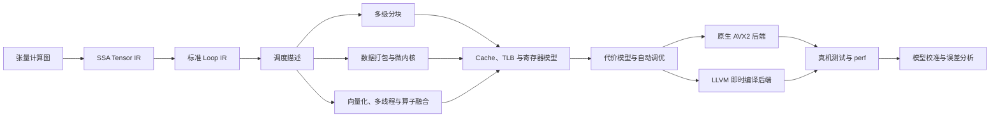

<div align="center">

# SchedForge

**SchedForge — A Target-Aware CPU Tensor Compiler**

**调度锻造器：把张量计算逐层编译成高效的 CPU 代码。**

[English](README.md) · [架构说明](docs/ARCHITECTURE.md) · [实验报告](results/FINAL_REPORT.md) · [参与贡献](CONTRIBUTING.zh-CN.md)

[](https://github.com/BokaiGuo/SchedForge/actions/workflows/ci.yml)
[](https://isocpp.org/)
[](https://llvm.org/)
[](LICENSE)

</div>

SchedForge 是一个使用 C++20 编写的 CPU 张量编译器原型，主要用于学习、
实验和编译器研究。项目从张量计算出发，将程序转换成可调度的循环中间表示，
再结合 Cache、TLB、寄存器压力和内存带宽模型筛选执行方案，最终交给原生
AVX2 后端或 `LLVM ORC JIT` 生成并执行机器代码。

项目没有追求“算子数量越多越好”，而是围绕融合的 FP32
`MatMul + Bias + ReLU` 深入打通一条完整链路：

```text
张量计算
  → SSA Tensor IR
  → Loop IR
  → 循环变换与调度搜索
  → 硬件代价预测
  → 原生 AVX2 / LLVM 即时编译
  → 真机测量与模型校准
```

同一份调度方案会同时交给循环变换、模拟器、原生后端、LLVM 后端和自动调优器，
避免出现“模拟器预测的是一种执行方式，真正运行的却是另一种实现”的问题。



## 主要能力

- **编译器基础设施**：实现 SSA 类型系统、`Value`、use-def 关系、
  `Operation`、嵌套 `Block`、`Module`、`IRBuilder` 和分层 PassManager。
- **Tensor IR 与 Loop IR 分层**：Tensor IR 描述“算什么”，Loop IR 描述
  “具体怎么执行”，调度策略独立于计算语义。
- **CPU 循环优化**：支持多级分块、MR/NR 寄存器分块、K 维展开、A/B 矩阵
  数据打包、软件预取、SIMD 向量化、尾部处理、算子融合和多线程执行。
- **两套可执行后端**：一套是原生 AVX2/FMA 微内核；另一套使用 LLVM 18
  构造 IR、执行 O3 优化并通过 `ORC LLJIT` 运行，同时支持汇编导出与检查。
- **硬件感知代价模型**：模拟组相联 L1/L2/L3 Cache、DTLB、软件预取、
  寄存器占用、潜在 Spill、数据打包开销和内存带宽。
- **自动调优**：支持网格搜索、随机搜索、贪心搜索和进化搜索，并使用模拟器
  先排序、再对少量候选进行真机测试。
- **运行时支持**：包含动态尺寸分桶、编译产物缓存、布局传播、生命周期内存规划、
  CPU 亲和性、NUMA 拓扑检测，以及 BF16、INT8 参考实现。

## 快速开始

### 1. 安装依赖

以下命令适用于 Ubuntu 24.04：

```bash
sudo apt-get update
sudo apt-get install -y \
  build-essential cmake ninja-build \
  llvm-18-dev llvm-18-runtime llvm-18-tools clang-18
```

如果还需要采集硬件性能计数器，可以安装：

```bash
sudo apt-get install -y linux-tools-common linux-tools-generic
```

### 2. 编译并运行测试

```bash
git clone https://github.com/BokaiGuo/SchedForge.git
cd SchedForge

cmake -S . -B build -G Ninja -DCMAKE_BUILD_TYPE=Release
cmake --build build --parallel
ctest --test-dir build --output-on-failure
```

如果 CMake 没有自动找到 LLVM，可以显式指定配置目录：

```bash
cmake -S . -B build -G Ninja \
  -DCMAKE_BUILD_TYPE=Release \
  -DLLVM_DIR=/usr/lib/llvm-18/lib/cmake/llvm
```

### 3. 体验完整工具链

```bash
# 查看 Tensor IR、调度后的 Loop IR 和生成的 LLVM IR
./build/schedforge-opt --M=129 --N=131 --K=127

# 查看 Cache、TLB、寄存器压力和预取效果的预测结果
./build/schedforge-sim --M=256 --N=256 --K=256

# 使用原生 AVX2 后端运行
./build/schedforge-run --backend=native --M=256 --N=256 --K=256

# 使用 LLVM 即时编译后端运行
./build/schedforge-run --backend=llvm --M=256 --N=256 --K=256

# 校准硬件参数后执行自动调优
./build/schedforge-bench --M=192 --N=192 --K=192 \
  --threads=8 --autoschedule --top-k=12 --calibrate
```

## 调度描述语言

SchedForge 使用一段紧凑文本描述执行方案。它不是某个后端的临时参数，而是
循环变换、模拟器、代码生成器和自动调优器共同使用的编译器对象。

```text
order=ikj;outer=64,128,64;tile=32,64,32;micro=4,8;
vector=8;unroll=4;threads=8;pack=ab;prefetch=4;fuse=true;pin=true
```

| 字段 | 作用 |
|---|---|
| `order` | 指定循环顺序，例如 `ijk` 或 `ikj` |
| `outer` | 设置 `MC,NC,KC` 外层分块 |
| `tile` | 设置 `BM,BN,BK` 内层 Cache 分块 |
| `micro` | 设置 `MR,NR` 寄存器分块 |
| `vector` | 设置 FP32 SIMD 向量宽度 |
| `unroll` | 设置 K 循环展开倍数 |
| `pack` | 选择是否打包 A、B 矩阵 |
| `prefetch` | 设置软件预取距离 |
| `threads` | 设置工作线程数量 |
| `fuse` | 选择是否融合 Bias 和 ReLU |
| `pin` | 选择是否将工作线程绑定到固定 CPU |

## 命令行工具

| 工具 | 用途 |
|---|---|
| `schedforge-opt` | 查看各级中间表示和 LLVM IR |
| `schedforge-sim` | 运行硬件模型并输出代价预测 |
| `schedforge-run` | 运行原生、LLVM、BF16 或 INT8 后端 |
| `schedforge-bench` | 搜索调度方案并测试候选性能 |
| `schedforge-calibrate` | 测量内存带宽并校准代价模型 |
| `schedforge-search` | 对比不同调度搜索算法 |
| `schedforge-study` | 分析数据打包收益和预测误差 |
| `schedforge-resolution` | 测量调优噪声与候选区分能力 |

## 实测结果

下面的数据来自一台 Intel Core i5-14600K，仅用于展示当前实现的实验结果，
不代表其他 CPU 或其他运行环境能够得到相同性能。

| 测试项目 | 实测结果 |
|---|---:|
| 原生后端真机自动调优，融合 192³ 矩阵乘 | **374.402 GFLOPS** |
| 原生后端真机自动调优，融合 256³ 矩阵乘 | **390.772 GFLOPS** |
| 原生后端真机自动调优，融合 512³ 矩阵乘 | **434.863 GFLOPS** |
| `LLVM ORC JIT` 后端，融合 192³ 矩阵乘 | **31.216 GFLOPS** |
| BF16 相对 FP32 的最大绝对误差，128³ | **0.0303** |
| INT8 相对 FP32 的最大绝对误差，128³ | **0.0805** |

在没有命中调优缓存时，自动调优器会先静态剔除非法 Schedule，再合并当前
Runtime 中执行路径完全相同的配置，然后把所有剩余候选都在真实 CPU 上运行
一轮。实测前列会以随机顺序进行多轮交错复测，最终选择完全依据真机中位数。
Simulator 只用于解释 Cache、TLB 和寄存器压力，不参与性能候选的晋级和选择。

完整实验方法、负结果、原始数据和结论的适用范围，请查看
[最终实验报告](results/FINAL_REPORT.md)。

## 项目结构

```text
include/schedforge/   对外公开的编译器、IR、运行时和模拟器接口
src/                  IR、循环变换、LLVM 后端、运行时、模拟器和调度器实现
tools/                命令行工具
tests/                单元测试与端到端测试
docs/                 架构说明和设计决策记录
results/              经过整理的实验结果与报告
scripts/              性能计数器辅助脚本
```

## 当前边界

- SchedForge 是用于学习和研究的 CPU 张量编译器原型，不是 BLIS、oneDNN
  或生产级图编译器的替代品。
- 当前只在真实硬件上验证了 AVX2 后端。AVX-512 和 NEON 目前只有目标抽象，
  不能视为已经完成并验证的机器码后端。
- 项目已经实现 NUMA 拓扑检测和任务划分，但实验机器只有一个 NUMA 节点，
  因此不对跨处理器插槽的性能作出结论。
- 模拟器只提供诊断信息，既不是性能选择裁判，也不会逐周期复现 Intel
  处理器的乱序执行。
- 性能会受到 CPU 型号、频率策略、编译器版本、输入规模和后台负载影响，
  请在自己的机器上重新运行实验。

## 延伸阅读

- [架构说明](docs/ARCHITECTURE.md)
- [实验方法](docs/EXPERIMENT.md)
- [最终实验报告](results/FINAL_REPORT.md)
- [架构决策记录](docs/decisions/)
- [中文贡献指南](CONTRIBUTING.zh-CN.md)
- [安全策略](SECURITY.md)

## 参与贡献

欢迎提交 Issue 和 Pull Request。开始之前请先阅读
[中文贡献指南](CONTRIBUTING.zh-CN.md)，并确保完整测试已经通过。

## 引用

如果 SchedForge 对课程、研究或工程实验有帮助，可以按照
[CITATION.cff](CITATION.cff) 中的信息引用本项目。

## 开源许可证

SchedForge 使用 [MIT License](LICENSE) 发布。
