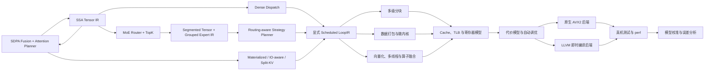

<div align="center">

# SchedForge

**SchedForge — A Model-to-Machine Target-Aware CPU AI Compiler**

**调度锻造器：把张量计算逐层编译成高效的 CPU 代码。**

[English](README.md) · [架构说明](docs/ARCHITECTURE.md) · [实验报告](results/FINAL_REPORT.md) · [参与贡献](CONTRIBUTING.zh-CN.md)

[](https://github.com/BokaiGuo/SchedForge/actions/workflows/ci.yml)
[](https://isocpp.org/)
[](https://llvm.org/)
[](LICENSE)

</div>

SchedForge 是一个使用 C++20 编写、同时面向稠密、动态路由稀疏与 Attention
张量程序的
model-to-machine CPU AI 编译器。它能够
导入 StableHLO 子集，构建真正的多算子 Tensor SSA Graph，执行 Shape 推导、
图正规化、融合、Dispatch 形成、Layout 传播、Bufferization 和 Workspace
复用，再通过 Structured Tensor Compute、Transform IR、Loop IR、Tensorization
和 LLVM 18 ORC JIT 或原生 AVX2 后端生成并执行 CPU 代码。

当前 Graph 级旗舰路径包括 Transformer MLP、Top-2 MoE MLP 与精确的 CPU
Flash-style Attention。MatMul 继续作为 Kernel
性能基准，MLP 则作为 Graph Compiler 基准，真实覆盖 use-def、融合边界、
动态 Shape Guard、临时张量、布局、内存生命周期和 Dispatch。

`Router → Softmax → TopK → Segmented Dispatch → Grouped Expert SwiGLU → Weighted Combine`。

`QKᵀ → Scale → Causal Mask → Online Softmax → PV`；IO-aware Lowering 不会物化
完整 Attention Matrix。

```text
StableHLO / AI Graph
  → Tensor SSA + Shape Inference
  → Fusion + Dispatch IR
  → Layout + Bufferization
  → Structured Compute + Transform IR
  → Scheduled Loop IR + Tensorization
  → LLVM IR / x86 Machine Code
  → ExecutablePlan + AI Runtime
```

同一份调度方案会同时交给循环变换、模拟器、原生后端、LLVM 后端和自动调优器，
避免出现“模拟器预测的是一种执行方式，真正运行的却是另一种实现”的问题。



## 主要能力

- **编译器基础设施**：实现 SSA 类型系统、`Value`、use-def 关系、
  `Operation`、嵌套 `Block`、`Module`、`IRBuilder` 和分层 PassManager。
- **Graph Compiler**：多算子 Tensor SSA、静态/动态/符号维度、Shape Constraint、
  StableHLO 子集导入、图正规化、Fusion Legality/Profitability、Dispatch IR。
- **MoE Compiler**：显式 Router/TopK/Histogram/Prefix/Dispatch/Combine IR、
  Segmented Tensor、Variable-M Grouped Expert GEMM、SwiGLU、Token Bucket、
  Routing Trace 与 Load-aware Expert Task Scheduler。
- **Attention Compiler**：SDPA 结构融合、MHA/GQA/MQA、Causal Tile、精确在线
  Softmax、TilePipelineIR、Materialized/IO-aware Prefill、可增长 KV Cache 与
  并行 Split-KV Decode。
- **内存与布局编译**：Layout 进入 Tensor Type；支持跨 Dispatch 布局传播、
  Bufferization、生命周期分析、64 字节对齐 Workspace 复用和 Guarded Specialization。
- **结构化 Kernel Compiler**：Iteration Domain、并行/归约 Iterator、Indexing Map、
  Transform IR 序列化与回放，以及由实测 Schedule 生成的变换程序。
- **显式可执行 LoopIR**：Schedule 会真正 rewrite 出 `scf.for`、
  `scf.parallel`、Pack、Prefetch、Load、Accumulator、Vector FMA、Epilogue
  和 Store。原生执行、Simulator 与 LLVM 都消费 LoopIR，不再读取 Schedule 字段。
- **CPU 循环优化**：支持多级分块、MR/NR 寄存器分块、K 维展开、A/B 矩阵
  数据打包、软件预取、SIMD 向量化、尾部处理、算子融合和多线程执行。
- **生成式微内核后端**：原生 AVX2 与 LLVM ORC 都支持寄存器驻留 MR×NR
  微内核；LLVM 路径真实生成 Vector FMA，并检查正确性与寄存器 Spill。
- **硬件感知代价模型**：模拟组相联 L1/L2/L3 Cache、DTLB、软件预取、
  寄存器占用、潜在 Spill、数据打包开销和内存带宽。
- **真机优先自动调优**：所有去重后的合法候选都先在真实硬件运行，再对实测
  前列随机交错复测；测量数据库可用于 analytical + learned 混合模型。
- **AI Runtime**：可序列化 `.sfe` ExecutablePlan，包含常量、Buffer、Dispatch、
  Shape Guard、Transform IR、LLVM Kernel Artifact 和 Workspace。
- **Transformer/推理抽象**：可执行 Dense MLP、MoE、IO-aware Prefill 与
  KV-cache Decode；量化 Tensor 元数据与传播、BF16/INT8 参考路径和动态 Guard。

## 快速开始

### 1. 安装依赖

以下命令适用于 Ubuntu 24.04：

```bash
sudo apt-get update
sudo apt-get install -y \
  build-essential cmake ninja-build \
  llvm-18-dev llvm-18-runtime llvm-18-tools clang-18
```

如果还需要采集硬件性能计数器，可以安装：

```bash
sudo apt-get install -y linux-tools-common linux-tools-generic
```

### 2. 编译并运行测试

```bash
git clone https://github.com/BokaiGuo/SchedForge.git
cd SchedForge

cmake -S . -B build -G Ninja -DCMAKE_BUILD_TYPE=Release
cmake --build build --parallel
ctest --test-dir build --output-on-failure
```

如果 CMake 没有自动找到 LLVM，可以显式指定配置目录：

```bash
cmake -S . -B build -G Ninja \
  -DCMAKE_BUILD_TYPE=Release \
  -DLLVM_DIR=/usr/lib/llvm-18/lib/cmake/llvm
```

### 3. 体验完整工具链

```bash
# 查看 Tensor IR、调度后的 Loop IR 和生成的 LLVM IR
./build/schedforge-opt --M=129 --N=131 --K=127

# 查看 Cache、TLB、寄存器压力和预取效果的预测结果
./build/schedforge-sim --M=256 --N=256 --K=256

# 使用原生 AVX2 后端运行
./build/schedforge-run --backend=native --M=256 --N=256 --K=256

# 使用 LLVM 即时编译后端运行
./build/schedforge-run --backend=llvm --M=256 --N=256 --K=256

# 校准硬件参数后执行自动调优
./build/schedforge-bench --M=192 --N=192 --K=192 \
  --threads=8 --autoschedule --top-k=12 --calibrate

# 将 StableHLO Transformer MLP 编译成可执行计划
./build/schedforge-compile examples/transformer_mlp.mlir \
  --target=native-cpu --batch=1 --sequence=16 \
  --hidden=64 --intermediate=128 --threads=4 \
  -o results/transformer_mlp.sfe

# 编译并真实运行动态路由 Top-2 MoE MLP
./build/schedforge-moe --tokens=128 --hidden=512 --intermediate=2048 \
  --experts=8 --top-k=2 --threads=8 --router-data \
  --strategy=auto -o results/moe_mlp.sfe

# 编译并真实运行 CPU Flash-style Causal Prefill
./build/schedforge-attention \
  --batch=1 --q-heads=8 --kv-heads=8 --sq=128 --sk=128 \
  --head-dim=64 --value-dim=64 --causal --threads=8 \
  --strategy=auto -o results/attention_prefill.sfe

# 使用 KV Cache 运行 GQA Split-KV Decode
./build/schedforge-attention \
  --batch=1 --q-heads=8 --kv-heads=2 --sq=1 --sk=1024 \
  --head-dim=64 --value-dim=64 --causal --threads=8 \
  --strategy=auto -o results/attention_decode.sfe

# 运行 Routing Skew、Grouped Execution 与 Scheduler 对比实验
./build/schedforge-moe --tokens=64 --hidden=64 --intermediate=128 \
  --experts=8 --top-k=2 --threads=8 --routing=heavy \
  --experiment-csv=results/moe_strategy_matrix.csv
```

## 调度描述语言

SchedForge 使用一段紧凑文本描述变换方案。Schedule 不是最终执行配置；应用
之后会生成显式 Scheduled LoopIR，执行后端不再接收 Schedule。

```text
order=ikj;outer=64,128,64;tile=32,64,32;micro=4,8;
vector=8;unroll=4;threads=8;pack=ab;prefetch=4;fuse=true;pin=true
```

重写后的 IR 会明确表达循环嵌套、并行、Packing、Prefetch、寄存器驻留归约、
向量宽度、Epilogue 作用域与 Store，进入目标后端前即可检查和验证。

| 字段 | 作用 |
|---|---|
| `order` | 指定循环顺序，例如 `ijk` 或 `ikj` |
| `outer` | 设置 `MC,NC,KC` 外层分块 |
| `tile` | 设置 `BM,BN,BK` 内层 Cache 分块 |
| `micro` | 设置 `MR,NR` 寄存器分块 |
| `vector` | 设置 FP32 SIMD 向量宽度 |
| `unroll` | 设置 K 循环展开倍数 |
| `pack` | 选择是否打包 A、B 矩阵 |
| `prefetch` | 设置软件预取距离 |
| `threads` | 设置工作线程数量 |
| `fuse` | 选择是否融合 Bias 和 ReLU |
| `pin` | 选择是否将工作线程绑定到固定 CPU |

## 命令行工具

| 工具 | 用途 |
|---|---|
| `schedforge-opt` | 查看各级中间表示和 LLVM IR |
| `schedforge-sim` | 运行硬件模型并输出代价预测 |
| `schedforge-run` | 运行原生、LLVM、BF16 或 INT8 后端 |
| `schedforge-bench` | 搜索调度方案并测试候选性能 |
| `schedforge-calibrate` | 测量内存带宽并校准代价模型 |
| `schedforge-search` | 对比不同调度搜索算法 |
| `schedforge-study` | 分析数据打包收益和预测误差 |
| `schedforge-resolution` | 测量调优噪声与候选区分能力 |
| `schedforge-compile` | 将 StableHLO Graph 编译为 `.sfe` ExecutablePlan |
| `schedforge-moe` | 编译、模拟、执行并对比 MoE Execution Plan |
| `schedforge-attention` | 编译、调优、模拟并执行 Attention Plan |

## MoE Compiler 实测 Demo

SchedForge 0.4 将 MoE Lower 为 18 个 Tensor SSA Operation 和 11 个
Routing/Expert Operation。生成的 `.sfe` 包含 Segmented Tensor 元数据、动态
Token Guard、Execution Strategy IR、按 Token Bucket 专门化的 W1/W3/W2
LoopIR 与经过 LLVM ORC 编译验证的 Kernel Artifact。

附件指定的完整 FP32 MVP：`T=128, H=512, I=2048, E=8, TopK=2`，已在当前
Intel Core i5-14600K 上真实运行，P50 延迟 **35.843 ms**、P95 延迟
**37.789 ms**，验证误差为 0。多行 AVX2 专家微内核会在多个路由 Token 之间
复用已加载的专家权重向量。这是单机 correctness-first 实现，不宣称已经达到
生产级 MoE 吞吐。

在仓库记录的完整尺寸实验 `T=128, H=512, I=2048` 中，Heavy Skew 下固定
Grouped 执行的模拟不均衡度为 2.0；Load-aware splitting 将其降为 0，并把实测
Grouped P50 从 **26.780 ms** 降至 **20.113 ms**。完整 27 组结果见
`results/moe_strategy_matrix.csv`。

## Attention Compiler 实测 Demo

SchedForge 0.5 会识别完整 SDPA 链并形成 `attention.sdpa`，在 Materialized、
Tiled Materialized、IO-aware Prefill 与 Split-KV Decode 之间选择。IO-aware
路径使用 `BQ×BK` TilePipelineIR，维护在线 Row Max、分母、Rescale 与 Output
Numerator；它是精确 Attention，并且不会分配完整 `Sq×Sk` Score/Probability。

在当前 Intel Core i5-14600K 上，Causal MHA Prefill
`B=1, H=8, Sq=Sk=128, D=64` 的 P50 为 **0.262 ms**，打印精度下误差为 0；
GQA Decode `Hq=8, Hkv=2, Sq=1, Sk=1024, D=64` 自动选择并行 Split-KV，
P50 为 **0.112 ms**，打印精度下误差为 0。

在 `S=512` 的四策略实测中，Materialized Attention 的临时内存为 **16 MiB**，
Auto-scheduled IO-aware 仅为 **49 KiB**；P50 从 **18.929 ms** 降至
**2.947 ms**。96 组 Scaling Analysis 覆盖 Head `8/12`、D `64/128` 和
序列长度 `128–4096`。`S=512`、200 次执行的 Linux PMU 记录为 P-core IPC
**2.561**、L1D Miss Rate **1.066%**、Cache-reference Miss Rate **16.230%**；
这些进程级计数包含 Runtime/框架开销。

## Graph Compiler 实测 Demo

仓库中的 `examples/transformer_mlp.mlir` 当前会生成：

- 12 个正规化后的 Tensor SSA Operation
- 2 个融合 Dispatch：`MatMul + Bias + GELU` 与 `MatMul + Bias + Residual`
- 跨 Dispatch 的 `blocked<6x16>` Layout 传播
- 朴素中间张量 32,768 字节，规划后 Workspace 8,192 字节
- 2 个携带 Transform IR 与 AVX2 Tensor Intrinsic 的 LLVM Kernel Artifact
- 每个 Dispatch 从 16,200 个生成候选中完成 3,825 次真机测量
- 当前记录主机上的原生 Scheduled Loop Runtime 为 0.021 ms
- 端到端 MLP 执行验证，最大误差低于 `1e-3`

可复现输出见 `results/transformer_mlp_compile.txt` 和
`results/transformer_mlp.sfe`。

## 实测结果

下面的数据来自一台 Intel Core i5-14600K，仅用于展示当前实现的实验结果，
不代表其他 CPU 或其他运行环境能够得到相同性能。

| 测试项目 | 实测结果 |
|---|---:|
| 原生后端真机自动调优，融合 192³ 矩阵乘 | **374.402 GFLOPS** |
| 显式 LoopIR 新鲜重测，融合 192³ 矩阵乘 | **369.728 GFLOPS** |
| 原生后端真机自动调优，融合 256³ 矩阵乘 | **390.772 GFLOPS** |
| 原生后端真机自动调优，融合 512³ 矩阵乘 | **434.863 GFLOPS** |
| `LLVM ORC JIT` 后端，融合 192³ 矩阵乘 | **31.216 GFLOPS** |
| BF16 相对 FP32 的最大绝对误差，128³ | **0.0303** |
| INT8 相对 FP32 的最大绝对误差，128³ | **0.0805** |

在没有命中调优缓存时，自动调优器会先静态剔除非法 Schedule，再合并当前
Runtime 中执行路径完全相同的配置，然后把所有剩余候选都在真实 CPU 上运行
一轮。实测前列会以随机顺序进行多轮交错复测，最终选择完全依据真机中位数。
Simulator 只用于解释 Cache、TLB 和寄存器压力，不参与性能候选的晋级和选择。

完整实验方法、负结果、原始数据和结论的适用范围，请查看
[最终实验报告](results/FINAL_REPORT.md)。

## 项目结构

```text
include/schedforge/   对外公开的编译器、IR、运行时和模拟器接口
src/                  IR、循环变换、LLVM 后端、运行时、模拟器和调度器实现
tools/                命令行工具
tests/                单元测试与端到端测试
docs/                 架构说明和设计决策记录
results/              经过整理的实验结果与报告
scripts/              性能计数器辅助脚本
```

## 当前边界

- SchedForge 是研究型 CPU AI 编译器原型，不是 oneDNN、XLA、IREE、TVM
  或生产级推理 Runtime 的替代品。
- Transformer MLP、FP32 Top-2 MoE、精确 IO-aware Prefill Attention 与连续
  KV Cache Split-KV Decode 已端到端执行并验证。
- 当前只在真实硬件上验证了 AVX2 后端。AVX-512 和 NEON 目前只有目标抽象，
  不能视为已经完成并验证的机器码后端。
- MoE 的 P-core/E-core 放置、NUMA-aware 执行、量化 Expert、Block-sparse
  Lowering 与分布式 Expert Parallelism 尚未实现。
- Attention 是面向 CPU Cache Hierarchy 的 Flash-style 精确 Attention，不是
  GPU FlashAttention-2 的实现或性能声明。
- Paged KV、BF16/INT8 Attention、Dropout/Backward、分布式 Attention 与生产级
  LLVM Fused Attention Machine Code 尚未实现。
- 模拟器只提供诊断信息，既不是性能选择裁判，也不会逐周期复现 Intel
  处理器的乱序执行。
- 性能会受到 CPU 型号、频率策略、编译器版本、输入规模和后台负载影响，
  请在自己的机器上重新运行实验。

## 延伸阅读

- [架构说明](docs/ARCHITECTURE.md)
- [Graph Compiler 与 `.sfe` 格式](docs/GRAPH_COMPILER.md)
- [显式 Scheduled LoopIR](docs/LOOP_IR.md)
- [MoE Compiler Pipeline](docs/MOE_COMPILER.md)
- [Attention Compiler Pipeline](docs/ATTENTION_COMPILER.md)
- [实验方法](docs/EXPERIMENT.md)
- [最终实验报告](results/FINAL_REPORT.md)
- [架构决策记录](docs/decisions/)
- [中文贡献指南](CONTRIBUTING.zh-CN.md)
- [安全策略](SECURITY.md)

## 参与贡献

欢迎提交 Issue 和 Pull Request。开始之前请先阅读
[中文贡献指南](CONTRIBUTING.zh-CN.md)，并确保完整测试已经通过。

## 引用

如果 SchedForge 对课程、研究或工程实验有帮助，可以按照
[CITATION.cff](CITATION.cff) 中的信息引用本项目。

## 开源许可证

SchedForge 使用 [MIT License](LICENSE) 发布。
