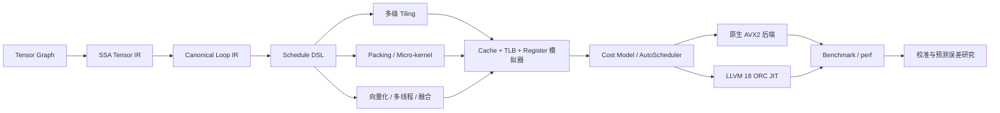

<div align="center">

# SchedForge

**SchedForge — A Target-Aware CPU Tensor Compiler**

**调度锻造器：将张量计算调度锻造成高效 CPU 代码。**

[English](README.md) · [架构文档](docs/ARCHITECTURE.md) · [实验报告](results/FINAL_REPORT.md) · [参与贡献](CONTRIBUTING.zh-CN.md)

[](https://github.com/BokaiGuo/SchedForge/actions/workflows/ci.yml)
[](https://isocpp.org/)
[](https://llvm.org/)
[](LICENSE)

</div>

SchedForge 是一个使用 C++20 实现、面向教学与研究的 CPU Tensor
Compiler。它把张量计算 Lower 到可调度的 Loop IR，通过
Cache/TLB/Register 代价模型筛选候选方案，再使用原生 AVX2 微内核或
LLVM 18 ORC JIT 执行最终代码。

项目选择深入完成一条核心主线——融合的 FP32 `MatMul + Bias + ReLU`，
而不是堆叠大量浅层算子。同一个 Schedule 对象会同时被 Lowering、模拟器、
原生后端、LLVM 后端、调试工具和 AutoScheduler 消费，从而保证“预测对象”
与“实际执行对象”一致。



## 项目亮点

- **编译器基础设施：** SSA `Type`、`Value`、use-def chain、`Operation`、
  嵌套 `Block`、`Module`、`IRBuilder` 与分层 PassManager。
- **Tensor/Loop 分层：** 将“算什么”与“怎么算”分离；模拟器与代码生成器
  消费同一份 Loop IR。
- **CPU Schedule：** 多级 tiling、MR/NR register block、K 展开、PackA/PackB、
  prefetch、SIMD、算子融合、线程亲和性与多线程执行。
- **双执行后端：** 原生 AVX2/FMA 微内核，以及真实 LLVM 18
  `IRBuilder` + O3 + ORC `LLJIT`，支持汇编生成和分析。
- **硬件感知模型：** 组相联 L1/L2/L3 Cache、DTLB、预取有效性、寄存器压力、
  spill penalty、packing 流量、带宽校准和 target-aware cost model。
- **自动调度与研究工具：** grid/random/greedy/evolutionary 搜索、模拟器 Top-k
  真机测量、Spearman 相关性和 Top-k recall 分析。
- **运行时能力：** 动态 shape bucket、持久化 kernel artifact、layout propagation、
  生命周期内存规划、NUMA 拓扑检测、线程绑定、BF16 和 INT8 参考路径。

## 快速开始

### 1. 安装依赖

Ubuntu 24.04：

```bash
sudo apt-get update
sudo apt-get install -y \
  build-essential cmake ninja-build \
  llvm-18-dev llvm-18-runtime llvm-18-tools clang-18
```

可选硬件计数器：

```bash
sudo apt-get install -y linux-tools-common linux-tools-generic
```

### 2. 构建与测试

```bash
git clone https://github.com/BokaiGuo/SchedForge.git
cd SchedForge

cmake -S . -B build -G Ninja -DCMAKE_BUILD_TYPE=Release
cmake --build build --parallel
ctest --test-dir build --output-on-failure
```

如果 CMake 没有自动定位 LLVM，可显式指定：

```bash
cmake -S . -B build -G Ninja \
  -DCMAKE_BUILD_TYPE=Release \
  -DLLVM_DIR=/usr/lib/llvm-18/lib/cmake/llvm
```

### 3. 运行工具链

```bash
# 输出 Tensor IR、Scheduled Loop IR 和 LLVM IR
./build/schedforge-opt --M=129 --N=131 --K=127

# 运行 Cache/TLB/Register/Prefetch 模拟
./build/schedforge-sim --M=256 --N=256 --K=256

# 原生 AVX2 后端
./build/schedforge-run --backend=native --M=256 --N=256 --K=256

# LLVM ORC JIT 后端
./build/schedforge-run --backend=llvm --M=256 --N=256 --K=256

# 校准后的自动调度
./build/schedforge-bench --M=192 --N=192 --K=192 \
  --threads=8 --autoschedule --top-k=12 --calibrate
```

## Schedule DSL

Schedule 是可被多个编译阶段复用的领域对象，而不是 LLVM 后端参数集合：

```text
order=ikj;outer=64,128,64;tile=32,64,32;micro=4,8;
vector=8;unroll=4;threads=8;pack=ab;prefetch=4;fuse=true;pin=true
```

| 字段 | 含义 |
|---|---|
| `order` | 循环顺序（`ijk` 或 `ikj`） |
| `outer` | `MC,NC,KC` 外层/Cache tile |
| `tile` | `BM,BN,BK` 内层 tile |
| `micro` | `MR,NR` 寄存器分块 |
| `vector` | FP32 SIMD lane 数量 |
| `unroll` | K 循环展开因子 |
| `pack` | Pack A、B、两者或均不 Packing |
| `prefetch` | 软件预取距离 |
| `threads` | Runtime 线程数量 |
| `fuse` | 是否融合 Bias/ReLU epilogue |
| `pin` | 是否将工作线程绑定到 CPU |

## 命令行工具

| 工具 | 用途 |
|---|---|
| `schedforge-opt` | 查看 Tensor IR、Loop IR 和 LLVM IR |
| `schedforge-sim` | 运行硬件模拟器与代价模型 |
| `schedforge-run` | 执行 native、LLVM、BF16 或 INT8 后端 |
| `schedforge-bench` | 自动调度并实测候选配置 |
| `schedforge-calibrate` | 校准内存带宽与模型比例 |
| `schedforge-search` | 对比不同 Schedule 搜索策略 |
| `schedforge-study` | 运行 Packing crossover 与预测误差实验 |

## 已记录实验结果

以下结果来自 Intel Core i5-14600K，仅作为仓库实验快照，不能视为跨平台性能承诺。

| 实验 | 记录结果 |
|---|---:|
| 校准后 native auto-schedule，融合 192³ | **84.584 GFLOPS** |
| LLVM ORC JIT，融合 192³ | **31.216 GFLOPS** |
| 模拟器/真机 Schedule Spearman | **0.968** |
| 模拟器 Top-5 / Top-10 recall | **0.40 / 0.70** |
| BF16 相对 FP32 最大误差，128³ | **0.0303** |
| INT8 相对 FP32 最大误差，128³ | **0.0805** |

完整方法、负结果、原始 artifact 和 claim boundary 请查看
[最终实验报告](results/FINAL_REPORT.md)。

## 项目结构

```text
include/schedforge/   编译器、IR、Runtime 与 Simulator 公共 API
src/                   IR、Lowering、LLVM、Runtime、模拟和调度实现
tools/                 编译器命令行工具
tests/                 单元测试与端到端测试
docs/                  架构与设计决策
results/               可复现实验快照和报告
scripts/               硬件计数器辅助脚本
```

## 范围与限制

- SchedForge 是 CPU Tensor Compiler 原型，不是 BLIS、oneDNN 或生产级图编译器的替代品。
- 当前只在真实硬件上验证了 AVX2。AVX-512 和 NEON 目前属于 Target abstraction，
  本版本不声称已经完成对应机器码后端验证。
- 已实现 NUMA-aware partitioning，但实验主机只有一个 NUMA node，因此不做跨 Socket 性能声明。
- Simulator 目标是相对 Schedule 排序，而不是 cycle-accurate Intel 乱序执行模拟。
- 性能受 CPU、频率策略、编译器、输入规模和后台负载影响，请在自己的机器上重新实验。

## 文档

- [架构说明](docs/ARCHITECTURE.md)
- [实验设计](docs/EXPERIMENT.md)
- [最终实验报告](results/FINAL_REPORT.md)
- [架构决策记录](docs/decisions/)
- [贡献指南](CONTRIBUTING.zh-CN.md)
- [安全策略](SECURITY.md)

## 参与贡献

欢迎提交 Issue 和 Pull Request。请先阅读 [贡献指南](CONTRIBUTING.zh-CN.md)，
并在提交前运行完整测试。

## 引用

如果 SchedForge 对课程、研究或工程实验有帮助，请使用 [CITATION.cff](CITATION.cff)
中的信息引用本仓库。

## 许可证

SchedForge 使用 [MIT License](LICENSE) 开源。
