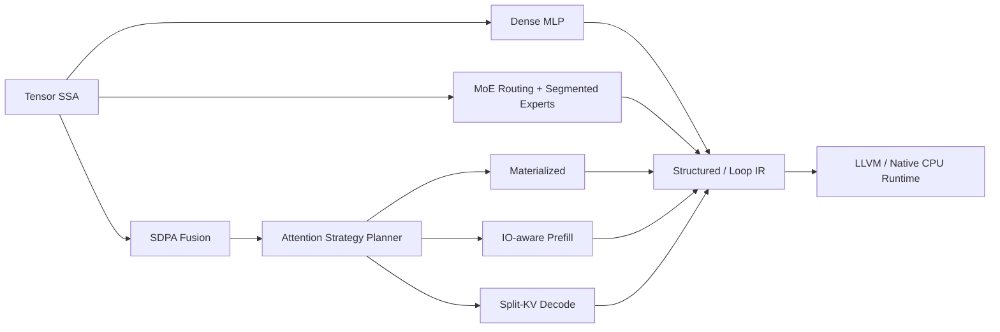

# SchedForge Architecture

SchedForge 0.16 is organized as a model-to-machine CPU AI compiler. The graph,
kernel, target, and runtime layers have separate IR objects and explicit
boundaries; the existing MatMul performance path remains the kernel laboratory,
while a complete Transformer Decoder Layer is the end-to-end graph workload.

SchedForge 0.16 — Model-to-Machine CPU AI Compiler

Frontend

StableHLO Subset<small>constants, dot_general, RMSNorm, RoPE, SiLU, SwiGLU</small>

Tensor SSA Graph<small>multi-op use-def graph</small>

Shape System<small>static, dynamic, symbolic</small>

Decoder Canonicalization<small>QKV, Gate-Up, SDPA, MoE</small>

↓

Graph Compiler

Shape Inference<small>constraints and runtime guards</small>

Decoder Fusion<small>RMSNorm, QKV, RoPE, Gate-Up</small>

Attention / MoE Plans<small>online softmax or routed experts</small>

Constant Specialization<small>packed QKV and Gate-Up</small>

Bufferization<small>tensor to physical buffers</small>

Memory Planner<small>lifetime and workspace reuse</small>

Dispatch IR<small>kernel boundary formation</small>

DecoderExecutablePlan<small>one graph, one plan, one call</small>

↓

Kernel Compiler

Structured Compute<small>iteration domain and indexing maps</small>

Transform IR<small>serialize, replay, apply</small>

AutoScheduler<small>real hardware measurement</small>

Scheduled Loop IR<small>tiling, packing, vectorization</small>

Tensorization<small>AVX2 tensor intrinsic matching</small>

Native Microkernel<small>register-resident MR×NR</small>

Measurement Database<small>hardware labels</small>

Hybrid Cost Model<small>analytical + learned</small>

↓

Target Compiler

LLVM Vector IR<small>vector FMA and graph epilogues</small>

LLVM O3<small>target-aware optimization</small>

ORC LLJIT<small>process-local kernel cache</small>

x86 Machine Code<small>AVX2/FMA validated</small>

↓

SchedForge Runtime

Decoder Runtime<small>Dense or MoE full-layer call</small>

Executable Runtime<small>constants, buffers, dispatches</small>

Worker Teams<small>topology-aware CPU affinity</small>

Hardware Feedback<small>latency, perf/PMU, validation</small>

## Decoder Layer Compilation Unit

The primary 0.10 unit is `RMSNorm → fused QKV → RoPE → exact GQA/MQA attention
→ output projection → residual → RMSNorm → Dense SwiGLU or MoE → residual`.
The compiler preserves the imported StableHLO graph, creates an explicit
canonical Decoder graph, specializes immutable projection weights, embeds the
Attention/MoE subplans, and serializes all executable LoopIR and LLVM artifacts
into one `DecoderExecutablePlan`.

## Whole-Graph Plan Optimization

SchedForge 0.9 adds a planning layer above individual dispatch selection.
`ExecutablePlanOptimizer` enumerates typed policies over Attention algorithm,
intermediate layout, materialization boundary, workspace reuse, schedule family,
thread count, and compact/spread placement. The analytical model only controls
which candidates receive the measurement budget; the selected plan is decided
by complete Decoder execution.

Candidate comparison uses equal warmup. Any preliminary challenger is then
compared against the default plan in three interleaved confirmation rounds.
This prevents cold-start order from being narrated as a compiler speedup. The
recorded Tiny Prefill case retains the baseline, while Tiny Decode `KV=512`
confirms a 1.400x improvement from the one-thread Split-KV policy.

The plan owns the selected policy, specialized constants, nested Attention/MoE
plans, physical buffers, workspace reuse decision, and executable dispatches.
MoE activations cross the runtime seam independently of expert weights, so
whole-layer execution does not copy the expert parameter store per invocation.

## End-to-End Pipeline

Dense, MoE, and Attention graphs share Tensor SSA and target lowering. MoE branches after
graph canonicalization into Router/TopK, histogram/prefix dispatch, Segmented
Tensor IR, grouped expert compute, and a routing-aware strategy planner before
rejoining dispatch bufferization and LoopIR lowering. Attention branches through
structural SDPA fusion and an algorithm planner: Materialized is the correctness
baseline, prefill lowers to an exact online-softmax TilePipelineIR, and decode
lowers to contiguous-KV Split-KV tasks with exact partial-state merging.

1. `StableHLOImporter` imports the supported StableHLO subset, including literal
   constants, into `TensorGraph`.
2. `GraphCanonicalizationPass` normalizes framework-level patterns such as the
   Transformer MLP GELU expansion.
3. `ShapeInferencePass` propagates tensor shapes and emits runtime constraints.
4. `FusionPlanner` evaluates use-def legality and materialization profitability,
   then forms `Dispatch` regions.
5. `GraphLayoutPlanner` propagates blocked layouts across compatible dispatches.
6. `GraphBufferizer` materializes only dispatch-boundary tensors and reuses an
   aligned workspace according to lifetime intervals.
7. `StructuredComputeLowering` preserves iteration domains, indexing maps, and
   reduction semantics before loop lowering.
8. `TransformProgram` records tiling, interchange, register tiling,
   vectorization, unrolling, packing, parallelization, and tensorization, then
   directly applies the recipe to create verified LoopIR.
9. Applying the winning transform rewrites an explicit Scheduled LoopIR with
   loops, parallel regions, pack/prefetch, vector reduction, epilogue, and store
   operations. Schedule is no longer an executable backend input.
10. Native execution, the cache/TLB simulator, and LLVM lowering consume that
    same verified LoopIR. Full-size simulation is the default; bounded sampling
    is explicit and recorded in the result.
11. Auto-tuning executes all deduplicated legal candidates on hardware and
   remeasures finalists in randomized rounds.
12. `TensorizationPass` maps structured contractions to target intrinsics such
    as `avx2_f32_m4n8`.
13. LLVM ORC generates register-resident MR×NR vector-FMA kernels for legal
    static shapes; irregular shapes use the safe vector-plus-tail path. ORC
    execution preserves LoopIR thread counts using MR-aligned disjoint row
    partitions rather than silently benchmarking one worker.
14. `ExecutablePlan` serializes graph IR, dispatches, memory plans, guards,
    Transform IR, Scheduled LoopIR, tensor intrinsics, and LLVM kernel artifacts
    into `.sfe`.

## Production LLVM Code Quality

Version 0.10 treats LLVM quality as an explicit compiler object. The same
Scheduled LoopIR is executed by native AVX2 and LLVM ORC, while generated
assembly is classified by total/vector/FMA instructions, loads, stores,
branches, address-generation proxies, stack accesses, and vector spill
patterns. `schedforge-codegen-study` stores the comparison as measured CSV.

Attention has a separate algorithm-level lowering from `TilePipelineIR` into
one ORC function. That function contains QK, legal causal key limits, exact
online maximum/denominator rescaling, PV numerator accumulation, and final
normalization. It supports MHA and GQA and partitions independent query rows
across the plan's worker count.

The checked-in results are deliberately not described as parity: LLVM MatMul is
1.8-2.5x slower than native across the recorded cubic rows, and fused LLVM
Attention is 2.1-3.1x slower than the specialized native runtime with a vector
spill pattern still present. These gaps define the next code-generation work.

## AOT Deployment Boundary

Version 0.11 reuses the optimized LoopIR LLVM module for a second target path:
LLVM `TargetMachine` emits a PIC ELF relocatable object, the system linker forms
`kernel.so`, and a versioned `.sfe` directory records the exact ABI, shape,
target triple, CPU, and checksums. The deployment runtime validates the package
and resolves `schedforge_matmul_v1` through `dlopen`/`dlsym`; LLVM compilation
is not present on the load or execution path.

The v1 AOT unit is intentionally narrower than the graph compiler: it is one
shape-specialized FP32 MatMul kernel, one target CPU, and one runtime thread.
Whole-graph constant relocation and multi-kernel dispatch are future extensions,
not implied by the existence of object emission.

## Runtime Milestone Line

The runtime now exposes Paged KV storage, INT8 weight-only MatMul, measured
transfer scheduling, NEON source/capability inspection, and deterministic
LoopIR fuzzing. These are explicit APIs in `next_milestones.h`, covered by
CTest and `schedforge-next-study`/`schedforge-fuzz`. The current x86_64 host
validates the first, second, third, and fifth slices directly; NEON is source
and capability validation only until an ARM host is available.

## Flagship Workloads

- **Kernel benchmark:** fused FP32 MatMul epilogues for schedule and
  microarchitecture research.
- **Dense graph benchmark:** Transformer MLP
  `Linear → Bias → GELU → Linear → Bias → Residual`, executed end to end.
- **Dynamic sparse benchmark:** Top-2 MoE MLP with Router, TopK, segmented token
  dispatch, variable-M grouped expert SwiGLU, weighted combine, and load-aware
  expert task scheduling, executed end to end.
- **Attention benchmark:** exact causal/non-causal MHA, GQA, and MQA with
  Materialized, Tiled Materialized, IO-aware prefill, and Split-KV decode
  algorithms, executed end to end.

## Claim Boundaries

- Dense MLP, FP32 Top-2 MoE, IO-aware prefill attention, and Split-KV decode are compiled, executed, and validated end to end.
- GELU and residual are explicit LoopIR epilogues executed by the native graph
  runtime. LLVM ORC currently lowers and validates the MatMul/bias kernel portion
  embedded in each dispatch artifact.
- LLVM-generated register microkernels are validated for legal static shapes;
  the native backend remains the highest-throughput path on the current host.
- Attention is a CPU Flash-style exact lowering, not a GPU FlashAttention-2
  implementation. Paged KV storage is implemented; direct page-aware tiled
  traversal and spill-free native-parity fused LLVM code remain future work.
- StableHLO support is deliberately a subset, not a complete specification
  implementation.
- AVX2 is validated on one Intel CPU; AVX-512, NEON, and multi-node NUMA require
  matching hardware validation.
